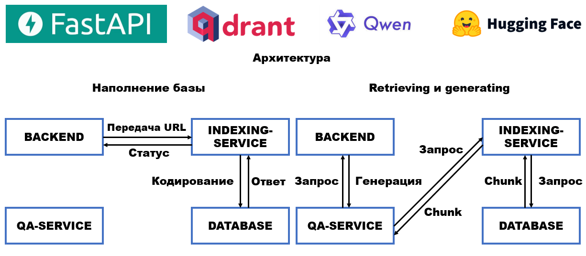

# RAG-сервис: система ответов на основе знаний с использованием Retrieval-Augmented Generation

## Описание

Этот проект представляет собой RAG (Retrieval-Augmented Generation)-сервис, предназначенный для предоставления ответов на вопросы пользователей на основе знаний, извлеченных из внешних источников. Сервис использует комбинацию поиска (retrieval) и генерации (generation) для предоставления релевантных и информативных ответов.

## Архитектура



Сервис состоит из следующих основных компонентов:

*   **Сервис индексации (indexing_service):**  Загружает данные из указанных URL, выполняет их предобработку и сохраняет векторные представления текстов в базе данных Qdrant.
*   **База данных Qdrant (database):**  Векторная база данных, хранящая векторные представления текстов и позволяющая выполнять быстрый поиск релевантных фрагментов.
*   **Сервис поиска (query_service):**  Получает поисковые запросы от пользователей, выполняет поиск релевантных фрагментов текста в базе данных Qdrant и генерации ответов на основе поискового запроса и извлеченных фрагментов текста.
*   **Бэкенд (backend):**  Предоставляет API для взаимодействия с сервисом, принимает запросы от пользователей и возвращает ответы.

## Предварительные требования

Перед запуском сервиса необходимо установить следующее программное обеспечение:

*   Docker и Docker Compose
*   Утилита Make
*   Python 3.9+

## Установка и запуск

1.  **Клонируйте репозиторий:**

    ```bash
    git clone https://github.com/Alatin-sergey/Rag_service_test.git
    cd Rag_service_test
    ```

2.  **Создайте файл `.env`:**

    На Windows: скопируйте содержимое файла `example.env` в файл `.env` командой make:

    ```bash
    make -f makefile copy_env_windows
    ```
    
    На Linux/Mac: скопируйте содержимое файла `example.env` в файл `.env` командой make:

    ```bash
    make -f makefile copy_env_linux
    ```

3.  **Укажите URL_DATA и LOCAL_HF_PATH в .env**

4.  **Запустите сервисы с помощью Docker Compose:**

    ```bash
    make -f makefile first_full_start
    ```

    Эта команда скопирует содержимое файла `example.env` в файл `.env`, соберет необходимые образы и запустит сервисы. Для правильной работы перед распаковкой сервиса добавьте в файл `.env` ссылку на базу данных формата .json.

## Использование

После запуска сервисов вы можете отправлять POST-запросы к следующим endpoint'ам:

1. `/indexing/`: Индексация данных из указанного URL.
    *   **Метод:** POST
    *   **Тело запроса:** JSON, содержащий поле `url` с URL данных для индексации.
    *   **Пример:**

        ```json
        {
            "url": "https://example.com/data.json"
        }
        ```
        
2. `/search/`: Поиск данных по запросу.
    *   **Метод:** POST
    *   **Тело запроса:** JSON, содержащий поле `query` с поисковым запросом.
    *   **Пример:**

        ```json
        {
            "query": "Что такое машинное обучение?"
        }
        ```


## Доступные команды Make

Для упрощения управления сервисом используются команды Make:

*   `make up`: Запускает сервисы с пересборкой образов.
*   `make down`: Останавливает сервисы.
*   `make copy_env_windows`: Копирует `example.env` в `.env` в Windows.
*   `make copy_env_linux`: Копирует `example.env` в `.env` в Mac/Linux.
*   `make build_*_image`: Собирает образ сервиса. Варианты для `*`: `torch`, `index`, `db`.
*   `make index_service_start`: Запускает `indexing_service`.
*   `make qa_service_start`: Запускает `qa_service`.
*   `make first_full_start`: Запускает все сервисы.

## Конфигурация

Сервис настраивается с помощью переменных окружения, которые определены в файле `.env`.  Основные переменные:

*   `DB_SERVICE`: Имя сервиса базы данных (по умолчанию: `database`).
*   `DB_PORT`: Порт базы данных (по умолчанию: `6333`).
*   `INDEXING_SERVICE`: Имя сервиса индексации (по умолчанию: `indexing_service`).
*   `INDEXING_HOST`: Хост сервиса индексации (по умолчанию: `0.0.0.0`).
*   `INDEXING_PORT`: Порт сервиса индексации (по умолчанию: `8050`).
*   `QUERY_SERVICE`: Имя сервиса поиска (по умолчанию: `qa_service`).
*   `QUERY_HOST`: Хост сервиса поиска (по умолчанию: `0.0.0.0`).
*   `QUERY_PORT`: Порт сервиса поиска (по умолчанию: `8040`).
*   `BACKEND_SERVICE`: Имя сервиса бэкенда (не указано в .env, но предполагается).
*   `BACKEND_HOST`: Хост сервиса бэкенда (по умолчанию: `0.0.0.0`).
*   `BACKEND_PORT`: Порт сервиса бэкенда (по умолчанию: `8001`).
*   `EMB_MODEL`: Имя модели для создания эмбеддингов (например, `Qwen/Qwen3-Embedding-0.6B`).
*   `EMB_SIZE`: Размер векторного представления текста (по умолчанию: `1024`).
*   `COLLECT_NAME`: Имя коллекции в базе данных Qdrant (по умолчанию: `collection`).
*   `MAX_CHUNKS`: Максимальное количество чанков, которое будет проиндексировано (по умолчанию: `100`).
*   `LOCAL_HF_PATH`: Путь к кэшу Hugging Face на локальной машине.
*   `HF_HOME`: Путь к кэшу Hugging Face в контейнере (по умолчанию: `/app/.cache`).
*   `URL_DATA`: URL для загрузки тестовых данных, например:`https://example.com/data.json`.

## Исследования и результаты

### Анализ качества и статистики текстовых данных

В рамках разработки RAG-сервиса было проведено исследование текстовых данных для определения оптимальной стратегии предобработки.

**Задачи исследования:**

*   Выявление проблем с качеством данных.
*   Определение статистических показателей текстов.

**Результаты анализа:**

*   **Статистика символов в отрывках:**
    *   Количество документов: 56952
    *   Общий объем текста: 25542946 символов
    *   Средняя длина документа: 448.50 символов
    *   Минимальная длина документа: 1 символов
    *   Максимальная длина документа: 11010 символов


Деление текстов по json-словарям происходило по абзацам (`\n` или `\n\n`). В результате парсинга блоки текста имеют длину от 1 символа, до 11010 символов.


**Статистика символов в статьях:**
*   Количество документов: 64493
*   Общий объем текста: 30848105 символов
*   Средняя длина документа: 478.32 символов
*   Минимальная длина документа: 30 символов
*   Максимальная длина документа: 512 символов


Статьи определялись по значению признака ru_wiki_pageid. По результатам анализа статей можно заключить, что наиболее короткие статьи представлены последовательностью из 30 символов.


**Проблемы в данных**
*   В данных обнаружены символы в кодировке, отличной от UTF-8.
*   В текстах обнаружены HTML-символы  : {'\u06dd', '\u200d', '\u200c', '\ufeff', '\xad', '\u200f', '\u200b', '\u200e', '\t'}
*   Тексты не нормализованы.
*   Встречаются тексты длиной в 1 символ.


**Анализ словарного состава (Vocabulary Analysis)**


Для улучшения качества поиска и понимания структуры данных был выполнен анализ словарного состава.


**Общее количество уникальных слов:** 314,304


**Топ-20 самых часто встречающихся слов:**
*   в: 204,706
*   и: 136,221
*   на: 67,032
*   с: 51,191
*   года: 29,532
*   по: 29,429
*   не: 24,135
*   из: 22,895
*   что: 22,322
*   году: 21,401
*   к: 21,100
*   а: 20,577
*   его: 16,693
*   был: 16,328
*   как: 16,253
*   от: 16,157
*   для: 15,589
*   он: 12,717
*   за: 12,478
*   о: 12,298

### Выводы по анализу данных

На основе проведенного анализа текстовых данных можно сделать следующие общие выводы:
1.  **Проблемы качества данных требуют решения:** Наличие символов в кодировке, отличной от UTF-8, HTML-символов, не нормализованных текстов и текстов длиной в 1 символ указывает на необходимость применения этапа очистки и нормализации данных в процессе предобработки. Это поможет повысить качество векторных представлений и, следовательно, релевантность результатов поиска.
2.  **Стратегия чанкизации важна:** Разбиение текстов на фрагменты (chunks) необходимо для работы с моделями, имеющими ограничения на длину входного текста. Важно подобрать оптимальный размер фрагмента и перекрытие между фрагментами, чтобы обеспечить сохранение контекста и высокую производительность.
3.  **Удаление стоп-слов не всегда оправдано:** Для моделей, использующих векторные представления, учитывающие контекст (например, Sentence Transformers), удаление стоп-слов (предлогов, союзов и т.п.) не рекомендуется, так как это может привести к потере важной смысловой информации.
4.  **Предобработка данных имеет решающее значение:** Эффективная предобработка данных, включающая очистку, нормализацию и разбиение на фрагменты, является ключевым фактором для обеспечения высокой точности и релевантности результатов поиска в RAG-сервисе.


*   **Статистика после предобработки и чанкования:**
    *   Количество документов: 64,493
    *   Общий объем текста: 30,848,105 символов
    *   Средняя длина документа: 478.32 символов
    *   Минимальная длина документа: 30 символов
    *   Максимальная длина документа: 512 символов (после чанкизации)

### Выводы по предобработке данных

Процесс предобработки данных играет критически важную роль в обеспечении высокого качества RAG-сервиса. Все входные данные, поступающие в систему, проходят через следующие этапы:

1.  **Очистка и нормализация текста:** Функция `clean_and_normalize_text` выполняет очистку текста от управляющих символов (Unicode categories 'Cc', 'Cf', 'Cs', 'Co', 'Cn') и символов с неизвестным именем. Также применяется нормализация Unicode (NFKC), что позволяет привести различные представления одних и тех же символов к единой форме.  Эта процедура применяется ко *всем* входным текстовым данным и позволяет существенно повысить качество векторных представлений, используемых для поиска.
2.  **Разбиение на фрагменты (чанкизация):** Функция `chunker` разбивает тексты на более мелкие фрагменты (chunks) для соответствия ограничениям на длину входного текста, которые могут быть у используемых языковых моделей.  При этом тексты с одинаковым `ru_wiki_pageid` сначала объединяются, а затем разбиваются на фрагменты с перекрытием в 100 символов, что позволяет сохранить контекст. Для разбиения используется `TokenTextSplitter` из библиотеки `llama_index.core`, который учитывает разбиение на токены при формировании фрагментов, что может быть более эффективно для некоторых моделей.


## Тесты

Чтобы провести тестирование, необходимо уставновить виртуальное окружение, соответствующее библиотекам, описанным в папке requirements + pytest. Находясь в корневой папке необходимо выполнить команду:

```bash
pytest -m unit
```

Чтобы запустить unit-тесты. Для выполнения инстегрированных тестов, необходимо запустить сервисы. Сначала выполнить команду проверки наполнения базы. В качестве ссылки для проверки применяется значение переменной `DATA_URL` из `.env`

```bash
pytest -m append
```

После этого можно выполнить проверку поиска.

```bash
pytest -m search
```


### Дальнейшее улучшение проекта

1. Переход на GPU
2. Использование асинхронного программирования
3. Создание интерфейса